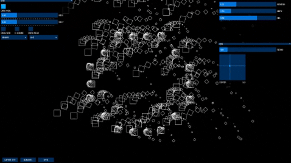

# Workshop Processing + Axidraw à l'école Ynov d'Aix en Provence
*du 10 au 21 mai 2021*

## Thème
Au croisement du design graphique et de la programmation, ce workshop propose d’utiliser l'environnement [Processing](https://processingfoundation.org/) / [p5.js](https://p5js.org/) pour créer, générer des formes géométriques afin de les imprimer à l’aide d’un [robot traceur](https://www.axidraw.com/) dans la lignée des pionniers de l'art génératif.

## Objectifs pédagogiques
* découverte de l'histoire de l'art génératif et plus largement du design génératif, évolutions des années 60 à nous jours.
* découverte de la programmation interactive temps réel, productions de visuels animés réagissant à des stimuli : mouvement(s), voix, ... 
* apprendre et maîtriser les concepts fondamentaux de la programmation : variables, boucles, branchements, fonctions. 
* apprendre à développer ses propres outils de création, création d'interface (UI) pour configurer et explorer les potentialités d'algorithmes de créations de formes graphiques.
* insérer ses productions de formes dans un workflow plus général.
* documenter ses explorations, penser une scénographie. 

## Programme
Le programme sera peut-être amené à évoluer au cours de la semaine en fonction de no 

#### Lundi 10 mai 2021
* Matin : 
  * Présentation de [Julien Gachadoat](https://www.instagram.com/julienv3ga/) et du studio de création numérique [2Roqs](http://www.2roqs.fr/).
  * Histoire de l'art génératif, principaux acteurs des années 60-70, mouvement actuel.
  * Présentation de l'environnement [Processing](https://processingfoundation.org/) et de son histoire.
* Après-midi : 
  * prise en main de l'environnement Processing, premiers pas en programmation. 
  * commandes de dessin, repère graphique, interactivité clavier / souris.
  * gestion de la couleur.
#### Lundi 17 mai 2021
* variables.
* nombres (pseudo) aléatoires.
* gestion du temps.
* transformation du repère de dessin.
* exporter au format vectoriel, importation dans des outils. 
* présentation du traceur et de sa prise en main pour être en autonomie.
#### Mardi 18 mai 2021
* boucles et fonction.
* travail personnel, accompagnement.
* premiers tests d'impressions.
#### Jeudi 20 mai 2021
* travail personnel, accompagnement.
* impressions avec le traceur.
#### Vendredi 21 mai 2021
* Matin : 
  * finalisation des impressions.
  * installation de l'espace scénographique.
* Après-midi : 
  * présentation du travail, captation (photos, vidéo)

### Références - liens
* [Julien Gachadoat / Atelier à Stéréolux](https://github.com/v3ga/Workshop_Processing_Axidraw_Stereolux_2019)
* [Tyler Hobbs / The importance of generative art](https://tylerxhobbs.com/essays/2021/the-importance-of-generative-art)
* [Mark Webster / Designing programs](https://designingprograms.bitbucket.io/index.html)
* **Artistes / pionniers** : 
  * [Vera Molnar](https://vimeo.com/372579247)
  * [Manfred Mohr](https://www.emohr.com/)
  * [Frieder Nake](http://dada.compart-bremen.de/item/agent/68)
  * [Georg Nees](http://dada.compart-bremen.de/item/exhibition/164)
  * [Michael Noll](http://dada.compart-bremen.de/item/agent/16)
* **Histoire plotter / computer** : 
  * [History of computer art part 2 : plotters](https://piratefsh.github.io/2019/01/07/computer-art-history-part-2.html)
* **Ressources outils / algorithmes** : 
  * [Creative coding notes](https://github.com/cacheflowe/creative-coding-notes)
  * [morphogenesis-resources](https://github.com/jasonwebb/morphogenesis-resources)
* **Exemple d'utilisations Axidraw** : 
  * [Joanie Lemercier / Alone in the desert](https://www.youtube.com/watch?v=p_wbldFTOeA)
  * [#plottertwitter](https://twitter.com/hashtag/Plottertwitter) sur Twitter et [#axidraw](https://www.instagram.com/explore/tags/axidraw/) sur Instagram 
    * [Andrew @beingheumann Heumann](https://www.instagram.com/beingheumann/)
    * Portraits de [Samer @spongenuity Dabra](https://www.instagram.com/spongenuity/)
    * [SquiggleDraw](https://github.com/gwygonik/SquiggleDraw)
* [The curse of truchet tiles](https://arearugscarpet.blogspot.com/2014/04/the-curse-of-truchets-tiles.html)
* [Machines à dessiner sur Canopé](https://www.reseau-canope.fr/machines-a-dessiner)
